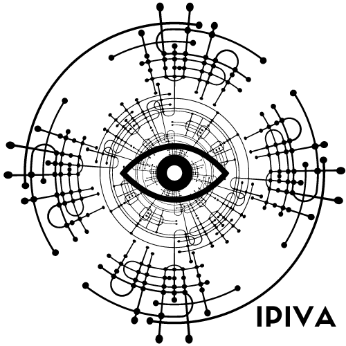
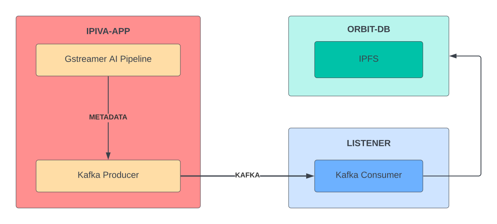
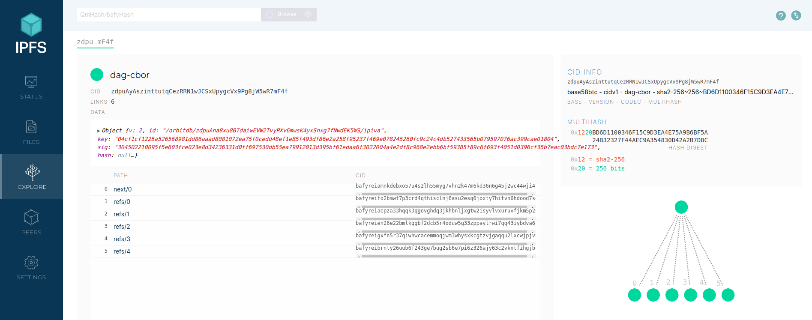

# IPIVA
## IPFS Intelligent Video Analytics
<p align="center">
  
</p>

IPIVA provides decentralized AI video analytics with sharing AI metadata across OrbitDB peer networks.

## Architecture

<p align="center">
  
</p>

# Requirements

Currently, this project only supports Nvidia GPUs under Linux systems.

```
docker
docker-compose==1.29.2 
```

Also you need login nvcr.io (Nvidia NGC):

```
$ docker login nvcr.io

Username: $oauthtoken
Password: <Your Key>
```
You can get \<Your Key\> in [Nvidia NGC](https://ngc.nvidia.com/setup/api-key). This is only required for installing Nvidia Deepstream docker image because IPIVA uses Deepstream for AI pipeline. 

# Build

After completing requirements, you can build the application by executing `build.sh` script. 

The script builds dockerfiles for IPIVA and creates 5 docker container:

* `ipiva-app` for IPIVA AI application.
* `ipiva-orbit-db` for communicating with OrbitDB.
* `ipiva-ipfs` for running IPFS deamon.
* `broker` for Kafka protocol.
* `zookeeper` for Kafka protocol.

# Running

Check if all IPIVA containers are running with `docker ps` command. If it is all good, then you can execute `run.sh` script under the scripts directory.

IPIVA will do the following,

1. Run AI application pipeline with predefined config.
2. Share model output metadata with Kafka as producer.
3. Run `listener.js` to connect Kafka as consumer and connect OrbitDB ipiva database.  
4. Consume Kafka buffer to get model metadatas.
5. Store metadata in OrbitDB ipiva database across to IPFS peer network.

# OrbitDB
OrbitDB is a serverless, distributed, peer-to-peer database. OrbitDB uses IPFS as its data storage and IPFS Pubsub to automatically sync databases with peers. 

IPIVA shares generated metadata shared across IPFS peer network with OrbitDB databases. IPIVA uses OrbitDB log database implementation and generates hash upon successfull database insertion. After running IPIVA application, you will see the following: 

```
Metadata saved to Orbit-db: zdpuAyAszinttutqCezRRN1wJCSxUpygcVx9Pg8jW5wR7mF4f
```

You can inspect each IPIVA generated metadata using IPFS inspect. Open `http://0.0.0.0:5001/webui` (IPIVA automatically launches webui, so you don't need to do anything) in your browser and inspect a metadata using top left seach bar. You will see the following:


<p align="center">
  
</p>


Under the `payload` key, we will see the metadata:

```
{
    "messageid": "2a5539de-fdf9-4e03-804e-168d49b05852",
    "mdsversion": "1.0",
    "@timestamp": "2022-09-04T17:28:54.996Z",
    "place": {
        "id": "0",
        "name": "HWY_20_AND_LOCUST__EBA",
        "type": "intersection/road",
        "location": {
            "lat": 30.32,
            "lon": -40.55,
            "alt": 100
        },
        "entrance": {
            "name": "C_127_158",
            "lane": "Lane 1",
            "level": "P1",
            "coordinate": {
                "x": 1,
                "y": 2,
                "z": 3
            }
        }
    },
    "sensor": {
        "id": "HWY_20_AND_LOCUST__EBA__4_11_2018_4_59_59_508_AM_UTC-07_00",
        "type": "Camera",
        "description": "Aisle Camera",
        "location": {
            "lat": 45.293701447,
            "lon": -75.8303914499,
            "alt": 48.1557479338
        },
        "coordinate": {
            "x": 5.2,
            "y": 10.1,
            "z": 11.2
        }
    },
    "analyticsModule": {
        "id": "XYZ_1",
        "description": "Vehicle Detection and License Plate Recognition",
        "source": "OpenALR",
        "version": "1.0"
    },
    "object": {
        "id": "975",
        "speed": 0,
        "direction": 0,
        "orientation": 0,
        "Person": {},
        "bbox": {
            "topleftx": 428,
            "toplefty": 479,
            "bottomrightx": 456,
            "bottomrighty": 545
        },
        "location": {
            "lat": 0,
            "lon": 0,
            "alt": 0
        },
        "coordinate": {
            "x": 0,
            "y": 0,
            "z": 0
        }
    },
    "event": {
        "id": "58d43a8e-c0ed-4db3-965e-68285d906c73",
        "type": "entry"
    },
    "videoPath": ""
}
```